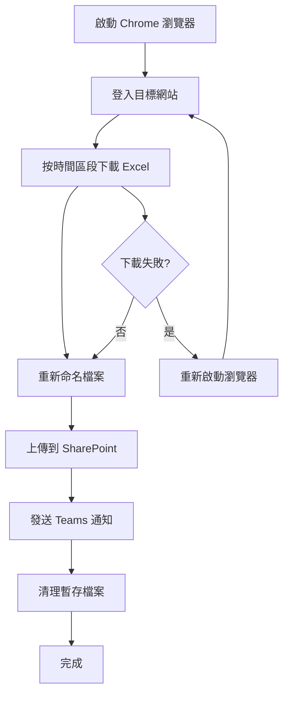

# 🤖 AI Tool Search RPA 自動化系統

> 一個強大的 Python RPA（Robotic Process Automation）系統，專為自動化下載 Excel 檔案、重新命名、上傳 SharePoint 並發送 Teams 通知而設計。

[](https://www.python.org/downloads/)
[](https://selenium-python.readthedocs.io/)
[](LICENSE)

## ✨ 主要功能

- 🔄 **全自動化流程** - 從登入到下載、上傳、通知的一站式解決方案
- 🌐 **智慧瀏覽器控制** - 使用 Selenium 進行穩定的網頁自動化
- 📊 **時間區段下載** - 按指定時間區段自動下載 Excel 檔案
- 📝 **智慧檔案管理** - 自動重新命名檔案為標準格式
- ☁️ **SharePoint 整合** - 自動上傳檔案到 SharePoint 雲端儲存
- 💬 **Teams 通知** - 執行完成後自動發送結果到 Microsoft Teams
- 📋 **完整日誌系統** - 詳細記錄每個執行步驟和錯誤追蹤
- 🧩 **模組化架構** - 清晰的程式碼結構，易於維護和擴展

## 🏗️ 系統架構

```
ai_tool_search/
├── 📁 automation/              # 自動化核心模組
│   ├── 🌐 browser/            # 瀏覽器管理
│   │   ├── browser_chrome.py  # Chrome 瀏覽器控制
│   │   └── login.py           # 網站登入功能
│   ├── 📥 download/           # 檔案下載模組
│   │   ├── download_excel.py  # Excel 下載功能
│   │   └── rename_query_file.py # 檔案重新命名
│   ├── ☁️ upload/             # SharePoint 上傳
│   │   └── upload_sharepoint.py
│   ├── 💬 notification/       # Teams 通知
│   │   └── notify_teams_result.py
│   └── 🛠️ utils/             # 工具函數
│       ├── clear_folder.py    # 資料夾清理
│       └── captcha_solver.py  # 驗證碼處理
├── 📁 utils/                  # 通用工具
│   ├── logger.py              # 日誌系統
│   └── execution_logger.py    # 執行記錄器
├── ⚙️ config.py               # 系統配置
├── 🚀 main.py                 # 主程式入口
├── 📋 requirements.txt        # 依賴套件清單
└── 📖 README.md              # 專案說明文件
```

## 🚀 快速開始

### 環境需求

- **Python 3.8+** - 建議使用 Python 3.9 或更新版本
- **Chrome 瀏覽器** - 最新版本
- **網路連線** - 穩定的網路連線
- **Windows 10/11** - 主要支援平台

### 安裝步驟

1. **克隆專案**

   ```bash
   git clone <repository-url>
   cd ai_tool_search
   ```

2. **建立虛擬環境**

   ```bash
   python -m venv venv
   ```

3. **啟動虛擬環境**

   ```bash
   # Windows
   venv\Scripts\activate

   # macOS/Linux
   source venv/bin/activate
   ```

4. **安裝依賴套件**
   ```bash
   pip install -r requirements.txt
   ```

### 環境配置

建立 `.env` 檔案並設定以下環境變數：

```env
# 🌐 網站設定
WEBSITE_URL=https://your-website.com
WEBSITE_USERNAME=your_username
WEBSITE_PASSWORD=your_password

# ☁️ Graph API 設定 (SharePoint 上傳)
GRAPH_API_CLIENT_ID=your_client_id
GRAPH_API_CLIENT_SECRET=your_client_secret
GRAPH_API_TENANT_ID=your_tenant_id
GRAPH_API_DRIVE_ID=your_drive_id
GRAPH_API_FOLDER_ID=your_folder_id

# 🤖 Azure OpenAI 設定 (驗證碼處理)
AZURE_OPENAI_ENDPOINT=your_endpoint
AZURE_OPENAI_API_KEY=your_api_key
AZURE_OPENAI_DEPLOYMENT_NAME=your_deployment_name

# 💬 Power Automate 設定 (Teams 通知)
POWER_AUTOMATE_WEBHOOK_URL=your_webhook_url
```

## 🎯 使用方法

### 基本執行

```bash
# 執行主程式
python main.py
```

### 配置調整

在 `config.py` 中可以調整以下設定：

```python
# ⏰ 時間設定
START_HOUR = 8      # 開始小時 (8:00)
END_HOUR = 18       # 結束小時 (18:00)
START_MINUTE = 0    # 開始分鐘
END_MINUTE = 60     # 結束分鐘
TIME_INTERVAL_MINUTES = 10  # 每10分鐘一個區段

# 🌐 瀏覽器設定
BROWSER_HEADLESS = False  # 設為 True 可隱藏瀏覽器視窗
BROWSER_TIMEOUT = 30      # 瀏覽器等待時間（秒）
DOWNLOAD_TIMEOUT = 300    # 下載超時時間（秒）
```

## 🔄 執行流程



### 詳細步驟

1. **🌐 瀏覽器啟動** - 開啟 Chrome 瀏覽器並設定 RPA 模式
2. **🔐 網站登入** - 自動登入目標網站
3. **📥 檔案下載** - 按時間區段下載 Excel 檔案
4. **📝 檔案重新命名** - 將檔案重新命名為標準格式
5. **☁️ SharePoint 上傳** - 自動上傳檔案到 SharePoint
6. **💬 Teams 通知** - 發送執行結果到 Teams
7. **🧹 清理作業** - 清除暫存檔案

## 📊 日誌系統

系統提供完整的日誌記錄功能，包含：

- **階段化日誌** - 每個執行階段都有獨立的日誌名稱
- **詳細記錄** - 記錄所有操作步驟和錯誤資訊
- **檔案輸出** - 日誌同時輸出到控制台和檔案
- **執行摘要** - 提供完整的執行統計資訊

### 日誌範例

```
2025-01-30 14:08:53,284 - 啟動瀏覽器 - INFO - ✓ Chrome 瀏覽器成功啟動
2025-01-30 14:08:53,285 - 登入網頁 - INFO - ✓ 成功登入網站
2025-01-30 14:08:53,390 - 下載流程 - INFO - ⏱ 開始下載：8:00 到 8:09
2025-01-30 14:08:53,391 - 下載流程 - INFO - ✓ 檔案重新命名為：logger_url_20250130_0800-0809.xls
```

## 🧩 模組說明

### 🌐 Browser 模組

- **BrowserManager** - Chrome 瀏覽器管理類別
- **login()** - 網站登入功能

### 📥 Download 模組

- **download_excel()** - Excel 檔案下載功能
- **rename_query_file()** - 檔案重新命名功能

### ☁️ Upload 模組

- **upload_temp_files_to_sharepoint()** - SharePoint 上傳功能

### 💬 Notification 模組

- **report_download_status()** - Teams 通知功能

### 🛠️ Utils 模組

- **clear_temp_folder()** - 暫存資料夾清理
- **solve_captcha()** - 驗證碼處理

## 🐛 故障排除

### 常見問題

#### 1. Chrome 驅動程式問題

```bash
# 確保已安裝最新版本的 Chrome 瀏覽器
# webdriver-manager 會自動下載對應的驅動程式
```

#### 2. 網路連線問題

- ✅ 檢查網路連線
- ✅ 確認目標網站可正常存取
- ✅ 檢查防火牆設定

#### 3. 權限問題

- ✅ 確保有足夠的檔案讀寫權限
- ✅ 檢查 SharePoint 和 Teams 的 API 權限

#### 4. 環境變數問題

- ✅ 確認 `.env` 檔案存在且格式正確
- ✅ 檢查所有必要的環境變數都已設定

### 除錯模式

```python
# 在 config.py 中設定
LOG_LEVEL = "DEBUG"  # 顯示更詳細的日誌
BROWSER_HEADLESS = False  # 顯示瀏覽器視窗
```

## 📦 依賴套件

| 套件名稱          | 版本     | 用途           |
| ----------------- | -------- | -------------- |
| selenium          | >=4.15.0 | 瀏覽器自動化   |
| webdriver-manager | >=4.0.0  | 驅動程式管理   |
| pandas            | >=2.0.0  | 資料處理       |
| openpyxl          | >=3.1.0  | Excel 檔案處理 |
| pywin32           | >=306    | Windows API    |
| Pillow            | >=10.0.0 | 影像處理       |
| opencv-python     | >=4.8.0  | 電腦視覺       |
| pytesseract       | >=0.3.10 | OCR 文字辨識   |
| requests          | >=2.31.0 | HTTP 請求      |
| python-dotenv     | >=1.0.0  | 環境變數管理   |

## 🤝 貢獻指南

我們歡迎所有形式的貢獻！

### 如何貢獻

1. **Fork 專案**
2. **建立功能分支** (`git checkout -b feature/AmazingFeature`)
3. **提交變更** (`git commit -m 'Add some AmazingFeature'`)
4. **推送到分支** (`git push origin feature/AmazingFeature`)
5. **開啟 Pull Request**

### 開發環境設定

```bash
# 安裝開發依賴
pip install -r requirements.txt

# 執行測試
python -m pytest tests/

# 程式碼格式化
black .
```

## 📄 授權條款

本專案採用 MIT 授權條款 - 詳見 [LICENSE](LICENSE) 檔案

## 📞 聯絡資訊

如有問題或建議，請透過以下方式聯絡：

- 🐛 **問題回報**: [GitHub Issues](https://github.com/your-repo/issues)
- 📧 **電子郵件**: your-email@example.com
- 💬 **討論區**: [GitHub Discussions](https://github.com/your-repo/discussions)

## 🔄 版本歷史

### v1.0.0 (2025-01-30)

- ✨ 初始版本發布
- 🌐 基本的下載、上傳、通知功能
- 🧩 模組化架構設計
- 📋 完整的日誌系統
- 🤖 RPA 自動化流程

## ⚠️ 注意事項

- 使用本系統前請確保已獲得相關網站的授權
- 請遵守相關的使用條款和隱私政策
- 建議在測試環境中先進行測試
- 定期備份重要的配置檔案

---

**⭐ 如果這個專案對您有幫助，請給我們一個星標！**
